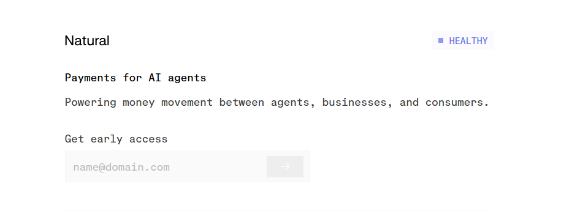

#### logic of this platform

is a tool that allows end users to see what natural enables them with!

its a shadow platform to manage AI agents spending before they hook up a real bank account.

#### 1. The SDK (Python/TypeScript Wrapper)

When the agent calls pay_invoice(amount, recipient), this SDK doesn't call the bank. It sends a JSON payload to your Shadow Dashboard and checks it against a Mock Policy

# natural_shadow.py
def natural_gatekeeper(agent_tool_call, policy_limits):
    # 1. Intercept the intent
    intent = agent_tool_call['arguments']
    
    # 2. Check against "Natural Mock Policy"
    if intent['amount'] > policy_limits['max_per_tx']:
        return {"status": "BLOCKED", "reason": "Exceeds threshold"}
    
    # 3. Log to Shadow Dashboard (Your Webhook)
    requests.post("https://your-shadow-dash.vercel.app/api/log", json=intent)
    return {"status": "SIMULATED_SUCCESS"}

#### 2. The Dashboard (Next.js + Tailwind + Shadcn)
Don't build a complex backend. Use even a simple JSON file on Vercel to store logs.
The UI: Create a "Live Feed" of agent attempts.
Column A: "Agent Reasoning" (Why the agent wanted to spend).
Column B: "Natural’s Decision" (Would it have been approved?).
Column C: "Risk Score" (Simulated fraud check).
The "Value" to Natural: They can use this in sales calls to say: "Look how many times your agent tried to overspend today. Our ledger caught all of them."

about ui and visuals: remember to create it so stunning black and white ui/ux such that top 0.001% of the world would love to use it!  and top 0.001% designers would die to design it!  

#### execution plan

1. (Build the SDK Wrapper): Create a simple Python package (even just a .py file) that wraps an OpenAI or any other free api call. Make it look professional with docstrings.

2. (The Shadow Dashboard):
Use a Vercel Next.js template.
Make it "Natural-branded" (use their website colors/font).
Host it on a public URL (e.g., natural-shadow-demo.vercel.app).
current natural ui 

